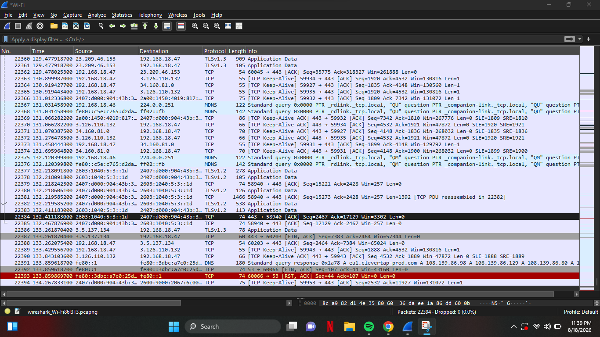
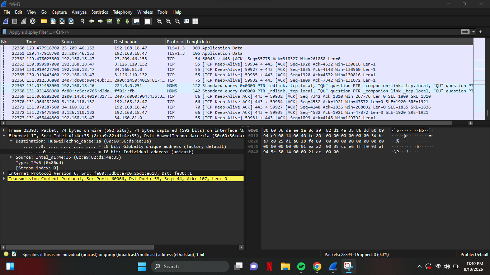

# Week 1 — Networking Basics: How Computers Talk

## Cyber Security Internship — DataNex

### Objective

The objective of this task was to understand how computers communicate over a network by capturing and analyzing my own computer's network traffic using Wireshark.

I captured network traffic for approximately one minute and analyzed the packets to understand IP addresses, ports, and packets.

---

## Tool Used

**Wireshark**

Wireshark is a network protocol analyzer that allows us to capture and inspect network traffic travelling between a computer and other devices or servers.

---

## 1. IP Address

An **IP (Internet Protocol) address** is an address used to identify a device on a network and allow data to be sent to the correct destination.

During my Wireshark capture, I observed my computer using the private IP address:

**Source IP:** `192.168.18.47`

I also observed communication with an external destination IP:

**Destination IP:** `3.5.137.134`

This shows that my computer was communicating with another device/server over the network.

The IP address `192.168.18.47` is a private/local IP address assigned to my computer on my local network.

---

## 2. Port

A **port** is a logical communication endpoint used to identify a particular network service or application on a device.

In one of the packets I analyzed, Wireshark showed:

**Source Port:** `60203`
**Destination Port:** `443`

Port `60203` was being used by my computer for this connection, while port `443` is commonly used for **HTTPS** communication.

Therefore, the traffic can be represented as:

`192.168.18.47:60203 → 3.5.137.134:443`

This means my computer was communicating from source port 60203 to destination port 443.

---

## 3. Packet

A **packet** is a small unit of data transmitted across a network. When information is sent over a network, it is divided into smaller units called packets.

Wireshark allowed me to see individual packets and inspect information such as:

* Source IP address
* Destination IP address
* Source port
* Destination port
* Protocol
* Packet length
* Other protocol information

For example, one packet I observed contained:

| Field            | Observation     |
| ---------------- | --------------- |
| Source IP        | `192.168.18.47` |
| Destination IP   | `3.5.137.134`   |
| Protocol         | TCP             |
| Source Port      | `60203`         |
| Destination Port | `443`           |

---

## 4. What I Learned

From this activity, I learned that network communication involves multiple layers of information.

The **IP address** identifies where the communication is coming from and where it is going. The **port** identifies the communication endpoint or service, while a **packet** carries a portion of the data being transmitted.

Wireshark makes it possible to observe this communication in real time and provides useful information for understanding and troubleshooting networks.

This activity also helped me understand why networking knowledge is important in Cyber Security. Security professionals can analyze network traffic to identify unusual communication, suspicious connections, and potential attacks.

---

## Evidence

### Wireshark Capture

The screenshot below shows the captured network traffic in Wireshark.

### Packet Details

The following screenshot shows the details of an analyzed packet, including its IP addresses, TCP protocol, and ports.

---

## Conclusion

This task gave me practical experience with network traffic analysis using Wireshark. I learned how to identify source and destination IP addresses, understand source and destination ports, and inspect individual network packets.

The activity provided a basic understanding of how data travels between my computer and other network devices and demonstrated the importance of packet analysis in Cyber Security.
